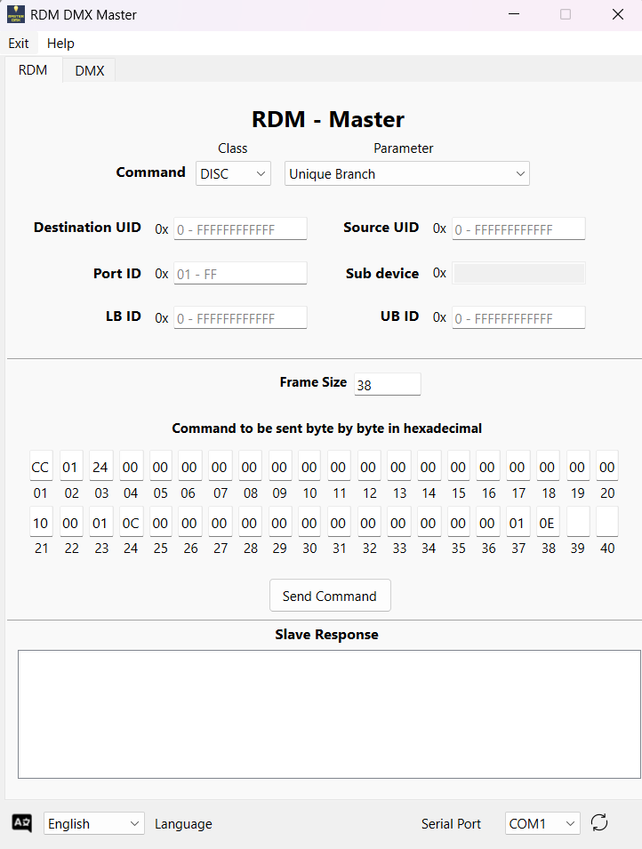
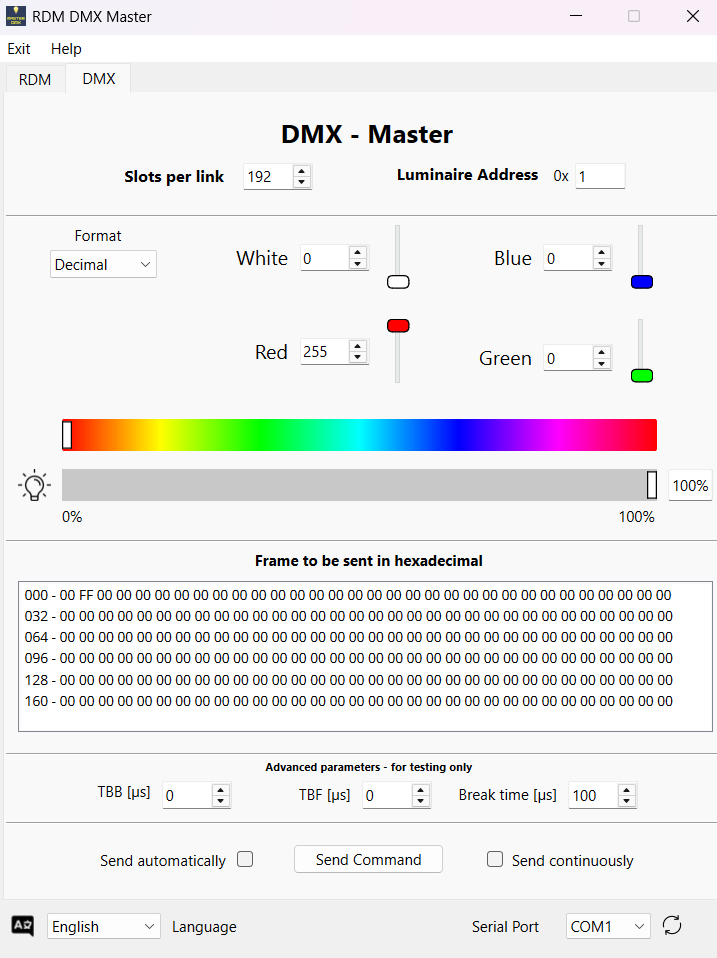

# RDM DMX Master

This project is a **graphical application for Windows** for controlling **DMX and RDM** devices, developed with **PyQt**. It allows users to send DMX commands, interact with RDM parameters, and visualize DMX and RDM frames in real-time. The interface provides DMX channel control, RDM discovery, and other features.

> **🌍 Available Languages:** 🇧🇷 **Portuguese** | 🇺🇸 **English**

---

## **DMX-Master-STM32 Board** 🎛️  

This software is designed to work alongside the **DMX-Master-STM32 board**, a dedicated hardware for DMX/RDM communication.

The board receives data via **USB-C**, interprets it, and converts it to the **DMX protocol**, enabling communication with lighting and control devices. Besides operating when connected to the software, the board can also function **independently**, through its **built-in graphical interface** and **physical buttons**.

🔗 **Board project link**: [DMX-Master-STM32](https://github.com/GuilhermeRS11/DMX_Master_STM32)

### **Board Features**  
✅ **USB-C connectivity** for communication with the software.  
✅ **CH340G converter** for serial interface.  
✅ **STM32C031K6T6 microcontroller** for processing.  
✅ **MAX485 converter** for DMX compatibility.  
✅ **5V → 3.3V voltage regulator** for circuit safety.  
✅ **128x64 OLED display (0.96'')** for onboard graphical interface.  
✅ **4 physical buttons** for manual adjustments.  

The onboard interface allows:  
🎛️ **DMX and RDM parameter adjustment**.  
📍 **Device addressing configuration**.  
📡 **Monitoring of received information**.  
🔘 **Direct control without the need for software**.  

---

## **Software Features** 💡

- **🎚️ DMX Control:** Send DMX frames and adjust color, brightness, and resolution of connected devices.  
- **🔍 RDM Support:** Communicate with RDM devices for discovery and configuration.  
- **🔌 Serial Port Integration:** Automatic detection of available COM ports.  
- **📊 Real-time Monitoring:** Display of received DMX/RDM frames.  
- **📑 Command Preview:** Inspect commands in detail before sending them.  

---

## **Installation** 🚀

### **🔹 Method 1: Using the Executable**
1. Download the `main.exe` file available in the project's `output` folder.  
2. Run `main.exe` directly on Windows.  

> **Note:** This method does not require dependency installation, but **Python must be installed** on the system.

### **🔹 Method 2: Manual Installation**

1. Clone the repository:
   ```bash
   git clone https://github.com/GuilhermeRS11/GUI_RDM_DMX_Master.git
   cd development
   ```

2. Install dependencies:
   ```bash
   pip install -r requirements.txt
   ```

3. Run the application:
   ```bash
   python main.py
   ```

## 🚀 How to Use?

1. **Connect the DMX-Master-STM32 board** to your computer via **USB-C**.
2. **Select the serial port**: The software automatically detects available **COM ports** for communication with DMX devices.
3. **Send DMX commands**: Use the **sliders** to adjust **brightness, colors, and other DMX values**.
4. **Interact with RDM devices**:  
   - 🔍 **Discover** connected RDM devices.  
   - ⚙️ **Retrieve and configure** parameters such as **DMX address** and **device identification**.  
   - 📡 **Monitor real-time responses** from RDM devices.  
5. **Preview frames before sending**:  
   - The software displays a **detailed breakdown** of each command before it is transmitted via the serial port.  

---

## 📦 Dependencies

To run the software manually, you need to install the following dependencies:

- 🐍 **Python 3.6+**
- 🖥 **PySide6** (or **PyQt6**) for the graphical interface
- 🔌 **`pyserial`** for serial communication
- ⚙️ **Custom RDM backend scripts** (`RDM_backend.py`)

To install all dependencies at once, run:
```bash
pip install -r requirements.txt
```

## 🔧 Future Improvements

The project is continuously evolving! Here are some planned enhancements for future releases:

- 🚀 **Optimized RDM Communication**: Implementation of **ACK_TIMER** and **overflow management** to ensure more stable and efficient RDM communication.

- 🎚️ **Expanded DMX Support**: Integration of **16-bit mode**, allowing for more precise DMX channel control.

- 🎨 **Graphical Interface Enhancements**: **Redesigned GUI** for a more intuitive and seamless user experience, improving navigation and usability.

- 📡 **Advanced Monitoring Tools**: Real-time **logs and diagnostics** to assist in debugging and troubleshooting.

- 🛠 **Expanded Compatibility**: Support for additional **DMX/RDM interface models** in upcoming updates.

---

## 📜 License

This project is licensed under **[GPLv3](https://www.gnu.org/licenses/gpl-3.0.txt)**, granting users the freedom to **use, modify, and distribute** the software, provided that the same freedoms are preserved.

---

## 📸 Program Screenshots

### **🔍 RDM Screen**
Discover and manage **RDM devices**, configure parameters, and monitor real-time responses.



### **🎨 DMX Screen**
Easily control **DMX lighting**, adjusting **color, brightness, and address settings**.

