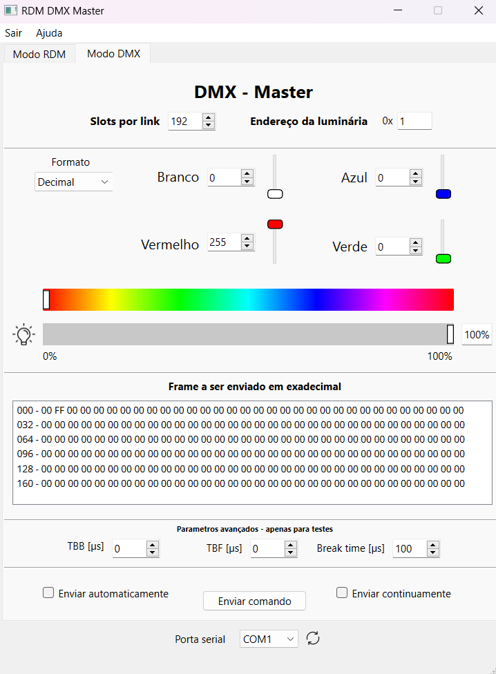

# RDM DMX Master

This project is a **graphical application for Windows** designed to control DMX and RDM devices, developed using **PyQt**. It allows users to send DMX commands, interact with RDM parameters, and visualize DMX and RDM frames in real-time. The interface provides control over DMX channels, RDM discovery, and other functionalities.

## Features

- **DMX Control**: Send DMX frames and adjust the color, brightness, and resolution of connected devices.
- **RDM Support**: Communicate with RDM-compliant devices, perform discovery, and manage parameters such as start addresses and device identification.
- **Serial Port Integration**: Automatic detection of available serial ports for communication.
- **Real-time Frame Monitoring**: Visual feedback on received RDM frames.
- **Command Preview**: View the structure of each DMX or RDM command before sending.

## Installation

### Method 1: Use the Executable

1. Download the `main.exe` file available in the `output` folder of the project.
2. Run the `main.exe` file directly in Windows.

> **Note**: This method does not require dependency installation.

### Method 2: Manual Installation

1. Clone the repository:
   ```bash
   git clone https://github.com/GuilhermeRS11/GUI_RDM_DMX_Master.git
   cd development
   ```

2. Install the necessary dependencies:
   ```bash
   pip install -r requirements.txt
   ```

3. Run the application:
   ```bash
   python main.py
   ```

## Usage

1. **Select a serial port**: The app automatically detects available COM ports for communication with DMX devices.
2. **Send DMX commands**: Adjust the sliders to modify brightness, colors, and other DMX values.
3. **RDM Interactions**: Execute RDM commands, such as device discovery, getting and setting parameters, and view the real-time response.
4. **Frame Preview**: Visualize and inspect DMX frames before sending them via the serial port.

## Dependencies

- Python 3.6+
- PySide6 (or PyQt6)
- `pyserial` for serial communication
- Custom RDM backend scripts (`RDM_backend.py`)

## Future Improvements

- Implement ACK_TIMER and overflow management in RDM communication.
- Add support for different DMX resolutions (e.g., 16-bit mode).
- Improve the GUI layout for better usability.

## License

This project is licensed under the [GPLv3 license](https://www.gnu.org/licenses/gpl-3.0.txt).

---

### Program Screenshots

**RDM Screen**:


**DMX Screen**:



---

**Note**: The project is currently in **Portuguese**, but the English translation will be available soon.
