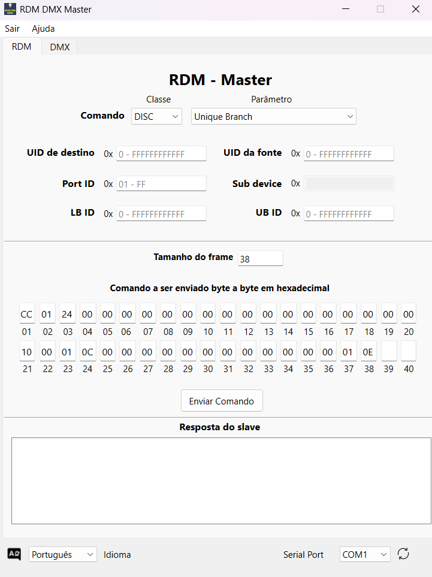
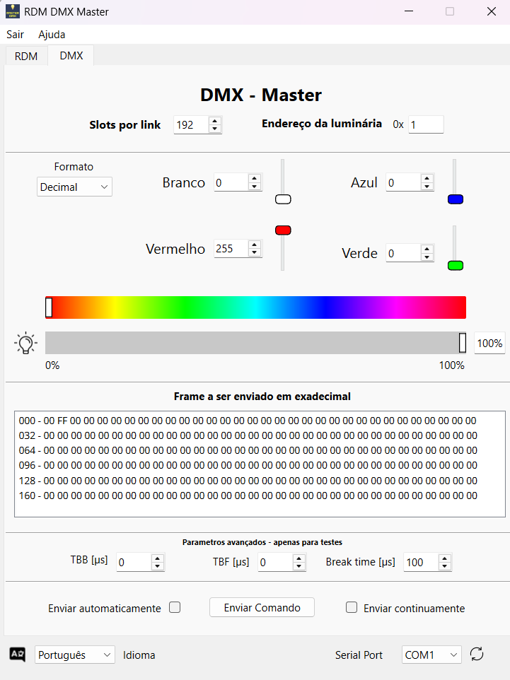

# RDM DMX Master

Este projeto é uma **aplicação gráfica para Windows** para controle de dispositivos **DMX e RDM**, desenvolvida com **PyQt**. Ele permite aos usuários enviar comandos DMX, interagir com parâmetros RDM e visualizar frames DMX e RDM em tempo real. A interface oferece controle dos canais DMX, descoberta RDM e outras funcionalidades.

> **🌍 Idiomas disponíveis:** 🇧🇷 **Português** | 🇺🇸 **English**

---

## **Placa DMX-Master-STM32** 🎛️  

Este software foi desenvolvido para funcionar em conjunto com a **placa DMX-Master-STM32**, um hardware dedicado para comunicação DMX/RDM.  

A placa recebe dados via **USB-C**, interpreta e converte para o protocolo **DMX**, permitindo comunicação com dispositivos de iluminação e controle. Além de operar conectada ao software, a placa também pode funcionar de forma **autônoma**, através de sua **interface gráfica embarcada** e **botões físicos**.  

🔗 **Link do projeto da placa**: [DMX-Master-STM32](https://github.com/GuilhermeRS11/DMX_Master_STM32)  

### **Características da Placa**  
✅ **Conectividade USB-C** para comunicação com o software.  
✅ **Conversor CH340G** para interface serial.  
✅ **Microcontrolador STM32C031K6T6** para processamento.  
✅ **Conversor MAX485** para compatibilidade com DMX.  
✅ **Regulador de tensão 5V → 3.3V** para segurança do circuito.  
✅ **Display OLED 128x64 (0.96'')** para interface gráfica embarcada.  
✅ **4 botões físicos** para ajustes manuais.  

A interface embarcada permite:  
🎛️ Ajuste de parâmetros **DMX e RDM**.  
📍 Configuração de **endereçamento** de dispositivos.  
📡 Monitoramento das informações recebidas.  
🔘 Controle direto sem necessidade do software.  

---

## **Funcionalidades do Software** 💡

- **🎚️ Controle DMX:** Enviar frames DMX e ajustar cor, brilho e resolução dos dispositivos conectados.  
- **🔍 Suporte a RDM:** Comunicação com dispositivos RDM para descoberta e configuração.  
- **🔌 Integração com portas seriais:** Detecção automática de portas COM.  
- **📊 Monitoramento em tempo real:** Exibição dos frames DMX/RDM recebidos.  
- **📑 Pré-visualização de comandos:** Inspeção detalhada antes do envio.  

---

## **Instalação** 🚀

### **🔹 Método 1: Usar o Executável**
1. Baixe o arquivo `main.exe` disponível na pasta `output` do projeto.  
2. Execute `main.exe` diretamente no Windows.  

> **Nota:** Este método não requer instalação de dependências mas é necessário possuir python instalado no sistema operacional.

### **🔹 Método 2: Instalação Manual**

1. Clone o repositório:
   ```bash
   git clone https://github.com/GuilhermeRS11/GUI_RDM_DMX_Master.git
   cd development
   ```

2. Instale as dependências:
   ```bash
   pip install -r requirements.txt
   ```

3. Execute o aplicativo:
   ```bash
   python main.py
   ```

## 🚀 Como Usar?

1. **Conecte a placa DMX-Master-STM32** ao computador via **USB-C**.
2. **Selecione a porta serial**: O software detecta automaticamente as portas COM disponíveis para comunicação com os dispositivos DMX.
3. **Envie comandos DMX**: Ajuste os sliders para modificar brilho, cores e outros valores DMX.
4. **Interaja com dispositivos RDM**: 
   - 🔍 Descubra dispositivos RDM conectados.
   - ⚙️ Obtenha e configure parâmetros, como endereço DMX e identificação do dispositivo.
   - 📡 Visualize respostas em tempo real.
5. **Pré-visualize os frames antes do envio**: O software exibe a estrutura detalhada de cada comando antes da transmissão pela porta serial.

---

## 📦 Dependências

Para rodar o software manualmente, você precisa instalar as seguintes dependências:

- 🐍 **Python 3.6+**
- 🖥 **PySide6** (ou **PyQt6**) para a interface gráfica
- 🔌 **`pyserial`** para comunicação serial
- ⚙️**Scripts backend RDM** personalizados (`RDM_backend.py`)

## 🔧 Melhorias Futuras

O projeto está em constante evolução! Algumas funcionalidades planejadas para as próximas versões incluem:

- 🚀 **Otimização da comunicação RDM**: Implementação de **ACK_TIMER** e gerenciamento de **overflow**, garantindo maior estabilidade na comunicação com dispositivos RDM.
- 🎚️ **Expansão do suporte DMX**: Implementação do **modo 16-bit**, permitindo controle mais preciso dos canais DMX.
- 🎨 **Aprimoramento da interface gráfica**: Melhorias no design da GUI para uma navegação mais intuitiva e fluida.
- 📡 **Monitoramento aprimorado**: Exibição detalhada de logs e respostas dos dispositivos para facilitar depuração e diagnóstico.
- 🛠 **Compatibilidade ampliada**: Suporte para mais modelos de interfaces DMX/RDM no futuro.

---

## 📜 Licença

Este projeto está licenciado sob a **[GPLv3](https://www.gnu.org/licenses/gpl-3.0.txt)**, permitindo o uso, modificação e distribuição do código, desde que as mesmas liberdades sejam garantidas.

---

## 📸 Imagens do Programa

### **🔍 Tela RDM**
Gerenciamento e descoberta de dispositivos **RDM**, permitindo configuração e monitoramento.



### **🎨 Tela DMX**
Controle de iluminação via **DMX**, ajuste de cores, brilho e endereçamento.




