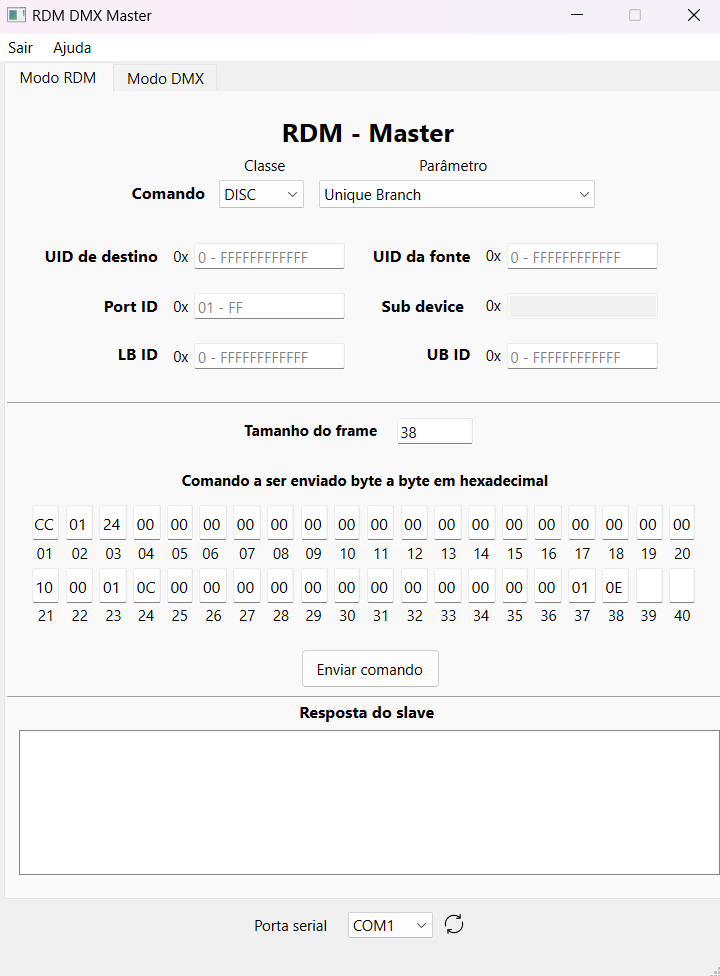
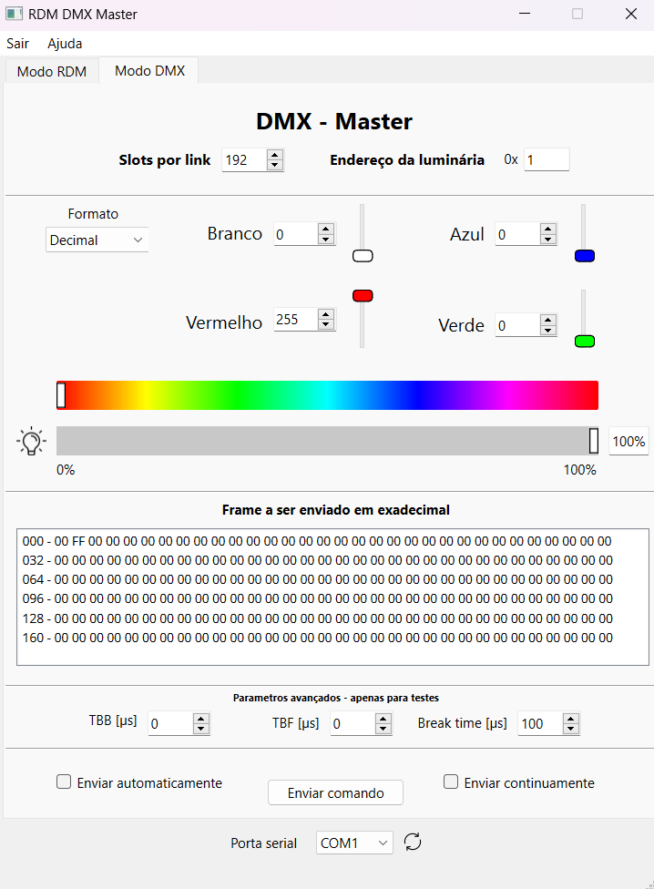

# RDM DMX Master

Este projeto é uma **aplicação gráfica para Windows** para controle de dispositivos DMX e RDM, desenvolvida com **PyQt**. Ele permite aos usuários enviar comandos DMX, interagir com parâmetros RDM e visualizar frames DMX e RDM em tempo real. A interface oferece controle dos canais DMX, descoberta RDM e outras funcionalidades.

## Funcionalidades

- **Controle DMX**: Enviar frames DMX e ajustar cor, brilho e resolução dos dispositivos conectados.
- **Suporte a RDM**: Comunicar-se com dispositivos compatíveis com RDM, realizar descoberta e gerenciar parâmetros como endereços iniciais e identificação de dispositivos.
- **Integração com portas seriais**: Detecção automática das portas seriais disponíveis para comunicação.
- **Monitoramento de frames em tempo real**: Feedback visual sobre frames RDM recebidos.
- **Pré-visualização de comandos**: Ver a estrutura de cada comando DMX ou RDM antes do envio.

## Instalação

### Método 1: Usar o Executável

1. Baixe o arquivo `main.exe` disponível na pasta `output` do projeto.
2. Execute o arquivo `main.exe` diretamente no Windows.

> **Nota**: Este método não requer instalação de dependências.

### Método 2: Instalação Manual

1. Clone o repositório:
   ```bash
   git clone https://github.com/GuilhermeRS11/GUI_RDM_DMX_Master.git
   cd development
   ```

2. Instale as dependências:
   ```bash
   pip install -r requirements.txt
   ```

3. Execute o aplicativo:
   ```bash
   python main.py
   ```

## Uso

1. **Selecione uma porta serial**: O app detecta automaticamente as portas COM disponíveis para comunicação com os dispositivos DMX.
2. **Envie comandos DMX**: Ajuste os sliders para modificar o brilho, cores e outros valores DMX.
3. **Interações RDM**: Execute comandos RDM, como descoberta de dispositivos, obtenção e configuração de parâmetros, e veja a resposta em tempo real.
4. **Pré-visualização de frames**: Visualize e inspecione os frames DMX antes de enviá-los pela porta serial.

## Dependências

- Python 3.6+
- PySide6 (ou PyQt6)
- `pyserial` para comunicação serial
- Scripts backend RDM customizados (`RDM_backend.py`)

## Melhorias Futuras

- Implementar gestão de ACK_TIMER e overflow na comunicação RDM.
- Adicionar suporte para diferentes resoluções DMX (por exemplo, modo 16-bit).
- Melhorar o layout da GUI para uma usabilidade mais intuitiva.

## Licença

Este projeto está licenciado sob a licença [GPLv3](https://www.gnu.org/licenses/gpl-3.0.txt).

---

### Imagens do Programa

**Tela RDM**:



**Tela DMX**:



---

**Nota**: O projeto está em **português** no momento, mas a tradução para **inglês** será disponibilizada em breve.
